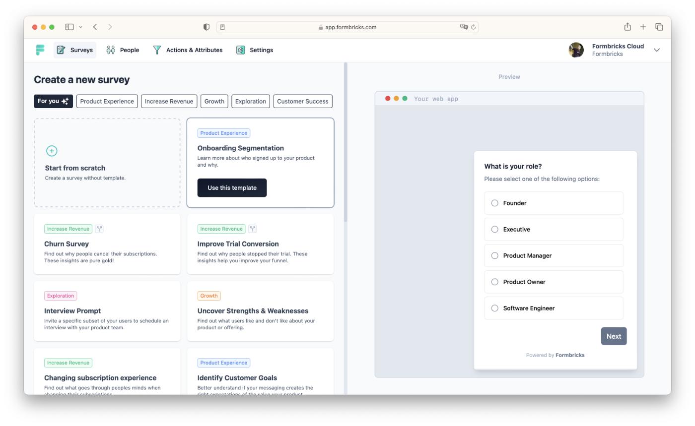

<!--
N.B.: This README was automatically generated by <https://github.com/YunoHost/apps/tree/master/tools/readme_generator>
It shall NOT be edited by hand.
-->

# Formbricks for YunoHost

[](https://ci-apps.yunohost.org/ci/apps/formbricks/)  

[](https://install-app.yunohost.org/?app=formbricks)

*[Read this README in other languages.](./ALL_README.md)*

> *This package allows you to install Formbricks quickly and simply on a YunoHost server.*  
> *If you don't have YunoHost, please consult [the guide](https://yunohost.org/install) to learn how to install it.*

## Overview

Formbricks is a privacy-first XM Suite built on the largest open source survey platform worldwide. 

### Features

- Create conversion-optimized surveys with our no-code editor with several question types.
- Choose from a variety of best-practice templates.
- Launch and target your surveys to specific user groups without changing your application code.
- Create shareable link surveys.
- Invite your organization members to collaborate on your surveys.
- Integrate Formbricks with Slack, Notion, Zapier, n8n and more.
- All open source, transparent and self-hostable.


**Shipped version:** 2.5.3~ynh1

## Screenshots



## Documentation and resources

- Official app website: <https://formbricks.com/>
- Official admin documentation: <https://formbricks.com/docs/developer-docs/contributing/get-started#local-machine-setup>
- Upstream app code repository: <https://github.com/formbricks/formbricks>
- YunoHost Store: <https://apps.yunohost.org/app/formbricks>
- Report a bug: <https://github.com/YunoHost-Apps/formbricks_ynh/issues>

## Developer info

Please send your pull request to the [`testing` branch](https://github.com/YunoHost-Apps/formbricks_ynh/tree/testing).

To try the `testing` branch, please proceed like that:

```bash
sudo yunohost app install https://github.com/YunoHost-Apps/formbricks_ynh/tree/testing --debug
or
sudo yunohost app upgrade formbricks -u https://github.com/YunoHost-Apps/formbricks_ynh/tree/testing --debug
```

**More info regarding app packaging:** <https://yunohost.org/packaging_apps>
