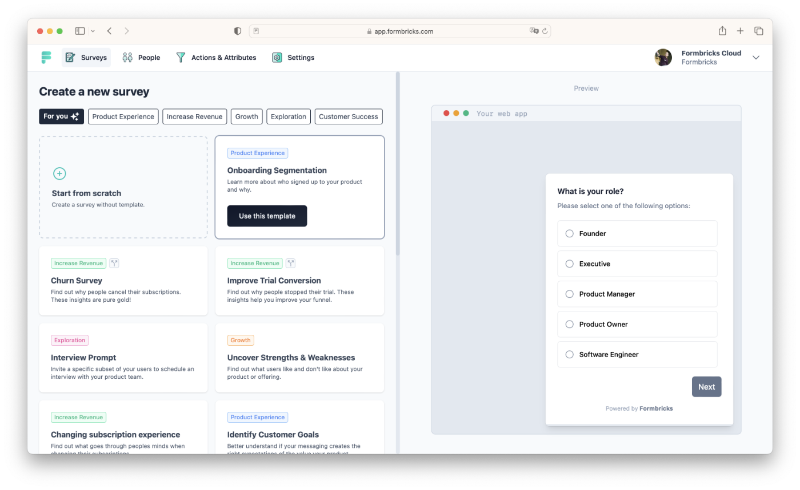

<!--
NOTA: Este README foi creado automáticamente por <https://github.com/YunoHost/apps/tree/master/tools/readme_generator>
NON debe editarse manualmente.
-->

# Formbricks para YunoHost

[](https://ci-apps.yunohost.org/ci/apps/formbricks/)  

[](https://install-app.yunohost.org/?app=formbricks)

*[Le este README en outros idiomas.](./ALL_README.md)*

> *Este paquete permíteche instalar Formbricks de xeito rápido e doado nun servidor YunoHost.*  
> *Se non usas YunoHost, le a [documentación](https://yunohost.org/install) para saber como instalalo.*

## Vista xeral

### Features

- Create conversion-optimized surveys with our no-code editor with several question types.
- Choose from a variety of best-practice templates.
- Launch and target your surveys to specific user groups without changing your application code.
- Create shareable link surveys.
- Invite your organization members to collaborate on your surveys.
- Integrate Formbricks with Slack, Notion, Zapier, n8n and more.
- All open source, transparent and self-hostable.


**Versión proporcionada:** 2.5.3~ynh1

## Capturas de pantalla



## Documentación e recursos

- Web oficial da app: <https://formbricks.com/>
- Documentación oficial para admin: <https://formbricks.com/docs/developer-docs/contributing/get-started#local-machine-setup>
- Repositorio de orixe do código: <https://github.com/formbricks/formbricks>
- Tenda YunoHost: <https://apps.yunohost.org/app/formbricks>
- Informar dun problema: <https://github.com/YunoHost-Apps/formbricks_ynh/issues>

## Info de desenvolvemento

Envía a túa colaboración á [rama `testing`](https://github.com/YunoHost-Apps/formbricks_ynh/tree/testing).

Para probar a rama `testing`, procede deste xeito:

```bash
sudo yunohost app install https://github.com/YunoHost-Apps/formbricks_ynh/tree/testing --debug
ou
sudo yunohost app upgrade formbricks -u https://github.com/YunoHost-Apps/formbricks_ynh/tree/testing --debug
```

**Máis info sobre o empaquetado da app:** <https://yunohost.org/packaging_apps>
